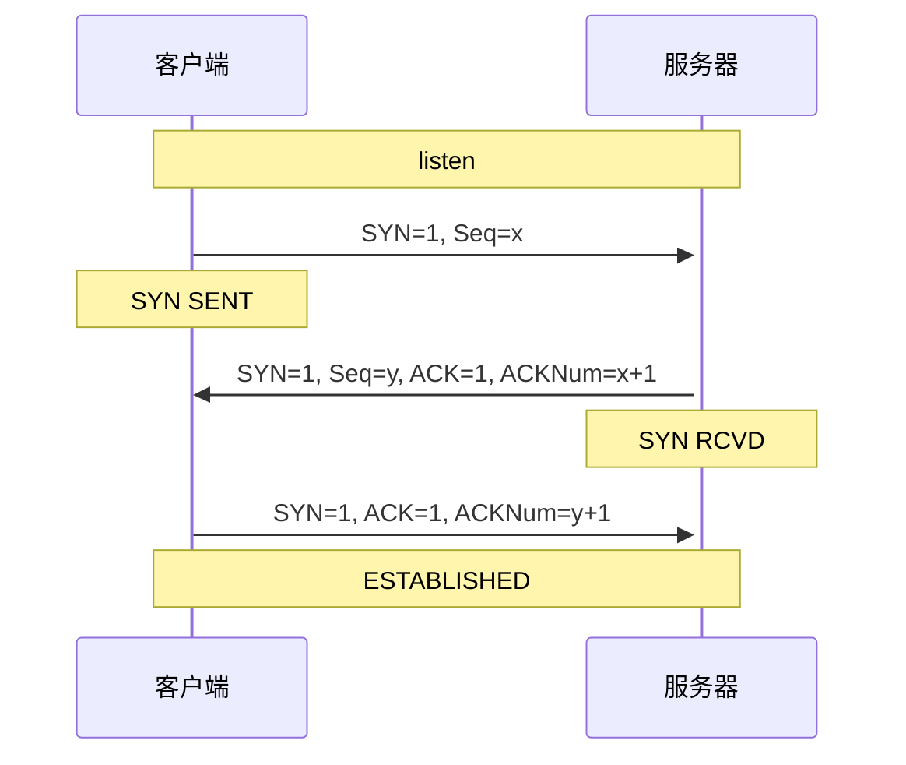

# ThreadTech

A description of this package.

## GCD

### 任务：串行队列

| 当前队列 | async | sync |
| ---- | ---- | ---- |
| 串行队列 | 新线程x1 一 顺序执行 | 目标线程 一 顺序执行 |
| 并行队列 | 新线程x1 一 顺序执行 | 新线程x1 一 顺序执行 |
| 全局队列 | 新线程x1 一 顺序执行 | 新线程x1 一 顺序执行 |
| 主队列 | 新线程x1 一 顺序执行 | 主线程 一 顺序执行 |

### 任务：并行队列

| 当前队列 | async                | sync                 |
| -------- | -------------------- | -------------------- |
| 串行队列 | 新线程xN 一 同时执行 | 目标线程 一 顺序执行 |
| 并行队列 | 新线程xN 一 同时执行 | 新线程x1 一 顺序执行 |
| 全局队列 | 新线程xN 一 同时执行 | 新线程x1 一 顺序执行 |
| 主队列   | 新线程xN 一 同时执行 | 主线程 一 顺序执行   |

### 任务：全局队列（并行）

| 当前队列 | async                | sync                 |
| -------- | -------------------- | -------------------- |
| 串行队列 | 新线程xN 一 同时执行 | 目标线程 一 顺序执行 |
| 并行队列 | 新线程xN 一 同时执行 | 新线程x1 一 顺序执行 |
| 全局队列 | 新线程xN 一 同时执行 | 新线程x1 一 顺序执行 |
| 主队列   | 新线程xN 一 同时执行 | 主线程 一 顺序执行   |

### 任务：主队列

| 当前队列 | async              | sync               |
| -------- | ------------------ | ------------------ |
| 串行队列 | 主线程 一 顺序执行 | 主线程 一 顺序执行 |
| 并行队列 | 主线程 一 顺序执行 | 主线程 一 顺序执行 |
| 全局队列 | 主线程 一 顺序执行 | 主线程 一 顺序执行 |
| 主队列   | 主线程 一 顺序执行 | DeadLock           |

## Group

分组管理异步任务

## NSThread（不常用）

面向对象的显存管理类，需要手动管理它的生命周期

## NSOperation

`NSOperation`是苹果公司提供的一套完整的多线程解决方案，实际上它是基于`GCD`更高一层的封装，完全面向对象。相对于GCD而言使用更加的简单、代码更具可读性。包括网络请求、图片压缩在内的诸多多线程任务案例都很好的使用了NSOperation。当然NSOperation还需要`NSOperationQueue`这一重要角色配合使用。

- **NSInvocationOperation**
- **NSBlockOperation**
- **自定义子类**

## TCP三次握手

