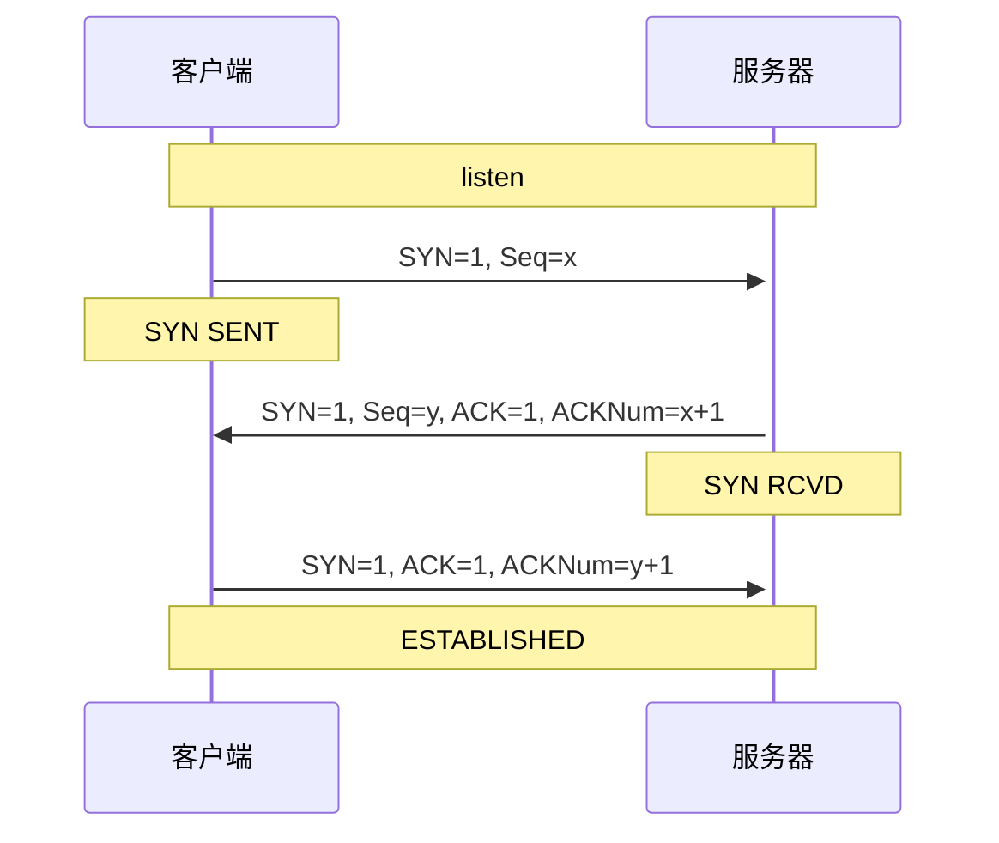

# 网络

### TCP三次握手

```mermaid
sequenceDiagram
Note over 客户端,服务器: listen
客户端->>+服务器: SYN=1, Seq=x
Note over 客户端: SYN SENT
服务器->>客户端: SYN=1, Seq=y, ACK=1, ACKNum=x+1
Note over 服务器: SYN RCVD
客户端->>服务器: SYN=1, ACK=1, ACKNum=y+1
Note over 客户端,服务器: ESTABLISHED
```
